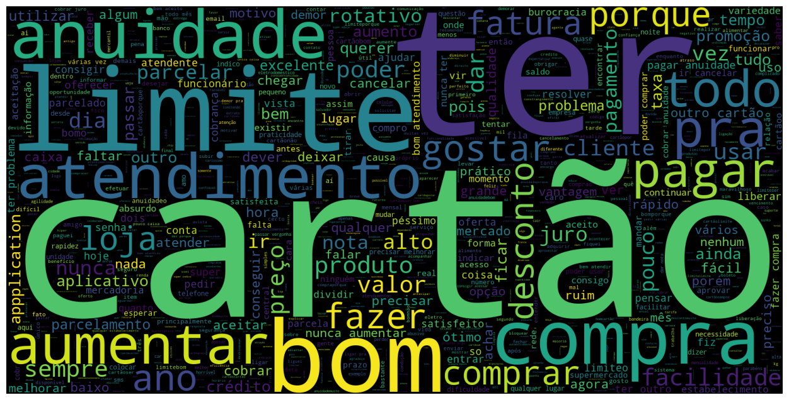
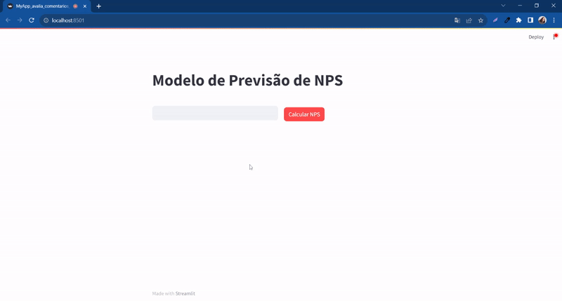
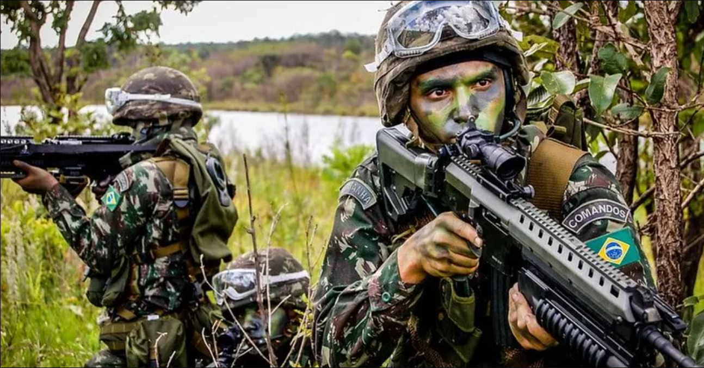
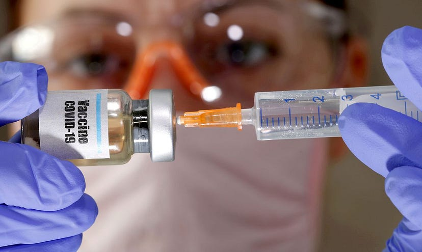
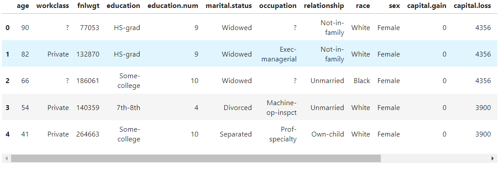

<!-- Google tag (gtag.js) -->

## Olá, Sou Rafael Gardel - Cientista de Dados, Mestre em Engenharia de Produção (USP).

[English version](https://rafaelgard.github.io/another-page.html)
[Baixar Currículo](https://drive.google.com/file/d/1uusQeZ7AcLOnGCJtL1M--fYsjOPY0v6H/view?usp=sharing)

Possuo 7 anos de experiência em programação e 4 anos de experiência com python, modelagem matemática, sql e análise de dados. 

Atualmente trabalho como Cientista de dados pleno prestando serviços para Ambev, atuo com modelagem matemática de problemas relacionados aos processos de produção de cerveja utilizando pesquisa operacional utilizando Python, Gurobi, Highspy e Pyomo.

Já trabalhei como Cientista de Dados com foco em logística e analista de CRM e BI Sr em uma multinacional do setor do varejo com foco em cartão de crédito.

Sou mestre em Engenharia de Produção na Poli-USP, com foco em Pesquisa Operacional, com destaque para modelagem matemática e otimização utilizando ferramentas como Gurobi e Pyomo, especialmente aplicadas a problemas logísticos e financeiros.

## Experiência Detalhada de Trabalho

**Cientista de Dados @ BRQ(Ambev) (_Maio 2024_ - _Outubro 2024_)**:
Dentro da BRQ eu atuei para a empresa Ambev realizando as principais atividades: 
Modelagem matemática de problemas relacionados aos processos de produção de cerveja utilizando pesquisa operacional utilizando Gurobi e Pyomo;
- Criação de modelos exatos (MILP) para os processos de filtração e de refrigeração.

**Analista de Dados @ Milenio Capital (_Janeiro 2024_ - _Abril 2024_)**:
Desenvolvimento e melhoria de dashboards no power bi e automação de atividades com Python.

**Cientista de Dados Freelancer@ Autonomo (_Julho 2023 - _Janeiro 2024_)**:
Atualmente, estou desenvolvendo projetos como freelancer em Python para duas empresas. Em ambos os projetos, estou utilizando NLP e machine learning para otimizar as estratégias de marketing e aumentar as vendas. 

- Processamento de linguagem natural (NLP) por meio de transformers.
- Criação de modelos de classificação e regressão.

**Cientista de Dados @ Thera Consulting (_Março 2023 - _Julho 2023_)**:
Trabalhei como cientista de dados, modelando e criando métodos específicos para um projeto de otimização envolvendo Brasil, China e Áustria.
- Modelagem matemática de problemas logísticos usando Gurobi.
- Refatoração de código em Python.
- Controle de versão de código com git e testes usando plataformas Azure e GCP.

**Analista Sênior de BI de CRM @ Cencosud (_Abril 2022 - _Fevereiro 2023_)**:
Trabalhei na área de CRM e BI de cartões de crédito para várias marcas, realizando as principais atividades:

- Geração de insights a partir da análise de dados em bancos de dados QlikView, Power BI e Microstrategy para aumentar as taxas de conversão de campanhas e produtos.
- Automatização de processos ETL, criei bancos de dados e gerei relatórios usando QlikView (scripting e macros) e Python.
- Migração de bancos de dados e relatórios existentes do QlikView para o Microstrategy na nuvem para uma criação de relatórios e geração de insights mais rápidos.
- Criação de modelos de machine learning (classificação, agrupamento, regressão, NLP e mineração de dados) para previsão de churn, gerando insights e uma melhor segmentação.
Estruturei e executei todo o fluxo de processo de ML para o departamento.

**Monitor, Universidade de São Paulo (USP) (_Abril 2021 - _Julho 2021_)** 
- Forneci suporte aos estudantes com dúvidas sobre modelagem e otimização de cursos de sistemas de produção.

**Estágios em Engenharia, (_Agosto 2015 - _Maio 2019_)** 
- Trabalhei em três empresas nos setores de Petróleo e Gás e Fibra Óptica, realizando atividades como mapeamento de processos, rastreamento de materiais no SAP, geração de indicadores e automação de planilhas Excel usando programação VBA.

## Educação
- Mestre em Engenharia de Produção | Universidade de São Paulo (USP): 
O foco da minha pesquisa é o roteamento de sondas offshore para produção de óleo e gás. (_2020_ - _2024_)	

- Link da minha Dissertação de Mestrado: [Programação de navios sonda heterogêneos em atividades offshore considerando a elegibilidade.](https://www.teses.usp.br/teses/disponiveis/3/3136/tde-26082024-102601/pt-br.php)

- Graduação, Engenharia de Produção	| Universidade Federal Fluminense (_Novembro 2019_)	 	

- Possuo 12 publicações, sendo 1 dissertação de mestrado em Engenharia de Produção, 5 capítulos de livro, 4 apresentações em congresso, 2 artigos e ministrei 2 minicursos de Python para Engenharia. Também possuo diversas publicações no Medium sobre gerenciamento de projetos, VBA e pesquisa científica.

- Ainda na graduação em Engenharia de Produção na UFF, participei de uma empresa júnior, atuando como diretor de marketing e também fui um dos fundadores do centro academico de Engenharia de Produção (CAEPRO) na área de Marketing.

## Linguagens e Ferramentas
- Python (Numpy, Numba, Pandas, Scikit-learn, TensorFlow, Seaborn, Plotly, Matplotlib)
- Criação de testes automatizados (Pytest, Github actions)
- Refatoração (Pylint)
- R (Análise Estatística)
- SQL (Mysql, SQL Server, PostgreSQL, DBeaver)
- Power Bi (DAX)
- Azure
- GCP
- Microstrategy
- Qlikview
- Airflow
- Docker
- GIT
- Julia
- C++
- VBA

## Minha experiência com programação

- Python, Machine Learning, SQL, Pesquisa Operacional, Otimização, Logistica, Power BI, Docker, Azure, GCP.

- Julia e C++: Foco em criação de heurísticas para problemas de otimização.

- Modelos de classificação, regressão, NLP, LLM, clusterização e modelos matemáticos de pesquisa operacional, especialmente envolvendo VRP no Gurobi, Pyomo e Highs.

## Trabalho Voluntário
**Diretor de Communicação, Centro Acadêmico de Engenharia, (2014 - 2016)** 
- Coordenei a comunicação entre o centro acadêmico e os estudantes.

**Diretor de Marketing, Empresa Júnior Focus Consultoria, (2014 - 2016)**
- Gerenciei relacionamentos da empresa com clientes e stakeholders.
- Estruturei prospecção de clientes e parceiros.
- Implementei estratégias de retenção de clientes.

### Idiomas
- Inglês avançado.
- Espanhol básico.
- Português nativo.

# 💻 Últimos Projetos
Atualmente, tenho 14 projetos em meu portfólio. Você pode conferir cada um deles abaixo:

<!-- BLOG-POST-LIST:START -->

## Implementing an hybrid of genetic algorithm and simulated annealing for the vehicle routing problem in Julia

Este projeto teve como objetivo criar uma aplicação simples da meta-heurística algoritmo genético aplicado ao problema de roteamento de veiculos (VRP), utilizando a linguagem Julia. A linguagem Julia foi escolhida por ser uma linguagem de alta performance com velocidade comparada a da linguagem C.

- [Clique aqui para ver o projeto no GitHub](https://github.com/rafaelgard/Implementing-a-genetic-algorithm-for-the-vehicle-routing-problem-in-Julia)

## OptiVision: Visualizing Optimization Algorithms

O objetivo deste projeto é responder uma pergunta: Se uma LLM descrever um cenário que represente o funcionamento de diversos algoritmos de otimização e uma LDM criar imagens destes cenários, como eles seriam?

- [Clique aqui para ver o projeto no GitHub](https://github.com/rafaelgard/OptiVision-Visualizing-Optimization-Algorithms)

## Projetos de Otimização com Gurobi, Highs e Pyomo

Este repositório contém implementações de 4 problemas de otimização:

- Problema de Roterização de Embarcações com Múltiplas Capacidades e Minimização de Custos;

- Problema de Roteirização de Embarcações com Múltiplas Capacidades e Programação de Embarques;

- Problema de Alocação de Combustíveis em Navios com Múltiplas Capacidades em Terminais Portuários;

- Roteirização de drones para vigilância de áreas estratégicas.

 Todos desenvolvidos usando as bibliotecas Gurobipy, Pyomo, Highspy e o solver GLPK. As soluções fornecem abordagens otimizadas para desafios relacionados ao roteamento de navios, alocação de combustível em navios e roteamento de drones para vigilância de áreas de interesse.

- [Clique aqui para ver o projeto no GitHub](https://github.com/rafaelgard/Projetos_de_Otimizacao_com_Gurobi_Highs_e_Pyomo)

## Simulated Annealing

Este projeto teve como objetivo criar uma aplicação simples e visual da meta-heurística Simulated Annealing no contexto de processamento de imagem.

Partindo de uma matriz que representa uma imagem, o algoritmo converge gradualmente para a imagem alvo, e é possível observar todo o processo de conversão executado pelo algoritmo.

O algoritmo utilizado é baseado no artigo original proposto por Kirkpatrick et al. (1983).
- [Clique aqui para ver o projeto no GitHub](https://github.com/rafaelgard/Simulated-annealing)

## Text Based Nps Predictor

Este projeto teve como objetivo criar um classificador usando técnicas de NLP para prever o NPS (Net Promoter Score) de um cliente com base em comentários inseridos pelo usuário.

A partir de um comentário, é possível indicar a previsão da classificação NPS do cliente, que pode ser: Detrator, neutro ou promotor.

Usando o modelo, é possível acelerar a avaliação de comentários e a classificação NPS para permitir uma resposta mais rápida aos clientes da empresa.

Um cliente concluiu uma pesquisa de satisfação e está muito insatisfeito? É possível detectar isso em tempo real com o modelo treinado e iniciar uma ação de prevenção de cancelamento, como acionar uma comunicação ou alerta no centro de relacionamento com o cliente.

- [Clique aqui para ver o projeto no GitHub](https://github.com/rafaelgard/text_based_nps_predictor)

## Análise de Avaliações, NLP e ML do Starbucks

Este projeto teve como objetivo realizar análise exploratória de dados, NLP e a criação de um modelo de machine learning para prever as notas de avaliação com base em comentários.

A partir de um comentário, é possível indicar a previsão da nota dada pelo cliente. Esta nota varia de 1 a 5.
- [Clique aqui para ver o projeto no GitHub](https://github.com/rafaelgard/Starbucks_Reviews_EDA_NLP_ML)

## Data Science Aplicado ao Alistamento Militar

O objetivo do projeto é analisar dados demográficos sobre pessoas que se alistam e prever as condições que implicam na seleção para servir no exército brasileiro.

Também fiz uma publicação no Medium descrevendo detalhadamente cada etapa dessa análise.

- [Clique aqui para ver o projeto no GitHub](https://github.com/rafaelgard/Data-Science-Aplicado-ao-Alistamento-Militar)
- [Clique aqui para ver o projeto no Medium](https://rafael-gardel.medium.com/data-science-aplicado-ao-alistamento-militar-411b727bbbb3)

## Analisando a Campanha Nacional de Vacinação contra a Covid-19 com Data Science

- Qual grupo foi o mais vacinado até agora? 
- Qual é a idade do brasileiro mais velho que já foi vacinado? 
- Quem lidera o ranking de pessoas vacinadas, homens ou mulheres? 
- Qual fabricante de vacina é mais comumente utilizada? 
- Qual é a idade média dos vacinados? 
- Qual é a cor predominante entre os vacinados? 

Essas e outras perguntas serão respondidas neste projeto.

- [Clique aqui para ver o projeto no GitHub](https://github.com/rafaelgard/Analisando-a-Campanha-Nacional-de-Vacina-o-contra-Covid-19-com-Data-Science)

- [Clique aqui para ver o projeto no Medium](https://rafael-gardel.medium.com/analisando-a-campanha-nacional-de-vacina%C3%A7%C3%A3o-contra-covid-19-com-data-science-621d6dc06f7c)

## Data Science aplicado à lista de espera do SUS na cidade do Rio de Janeiro

Quantos dias, em média, um carioca fica na lista de espera do SUS para realizar um procedimento? Quais são os procedimentos mais solicitados? Quais hospitais têm as filas mais longas? Qual é a idade do paciente mais velho na fila? E o mais jovem? Essas e outras perguntas serão respondidas neste projeto.

- [Clique aqui para ver o projeto no GitHub](https://github.com/rafaelgard/Data-Science-aplicado-a-lista-de-espera-do-SUS-na-cidade-do-Rio-de-janeiro)
- [Clique aqui para ver o projeto no Medium](https://rafael-gardel.medium.com/data-science-aplicado-a-lista-de-espera-do-sus-na-cidade-do-rio-de-janeiro-2203ade764ac)

## Adult income dataset analysis
Um estudo sobre a renda anual individual resultante de vários fatores, como educação, idade, sexo, ocupação, etc.

- [Clique aqui para ver o projeto no GitHub](https://github.com/rafaelgard/Adult-income-dataset-analysis)

<!-- BLOG-POST-LIST:END -->

---

### 💡 Outros projetos interessantes que eu desenvolvi
<!-- BLOG-POST-LIST:START -->
- [Minicourse-Python-To-Engineering](https://github.com/rafaelgard/Minicurso-Python-Para-Engenharia)
- [Gurobi_helper](https://github.com/rafaelgard/Gurobi_helper)
- [Pandas_to_NLP](https://github.com/rafaelgard/Pandas_to_NLP)
- [Append_CSV](https://github.com/rafaelgard/Junta_CSV)
<!-- BLOG-POST-LIST:END -->

---
You can reach me out on any channels below!

- [Meu LinkedIn](https://www.linkedin.com/in/rafael-gardel-b1976999/)
- Também tenho um blog no [Medium](https://https://rafael-gardel.medium.com/)
- Você também pode me enviar um [email](mailto:rafaelgardel@usp.br)

