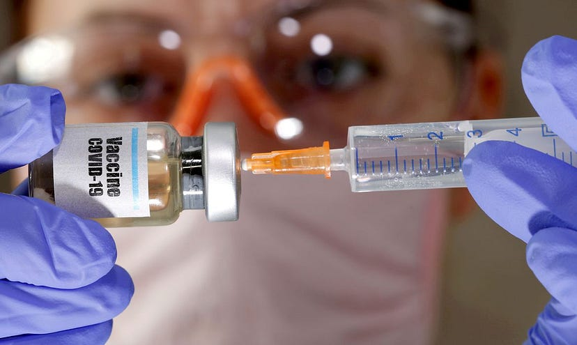
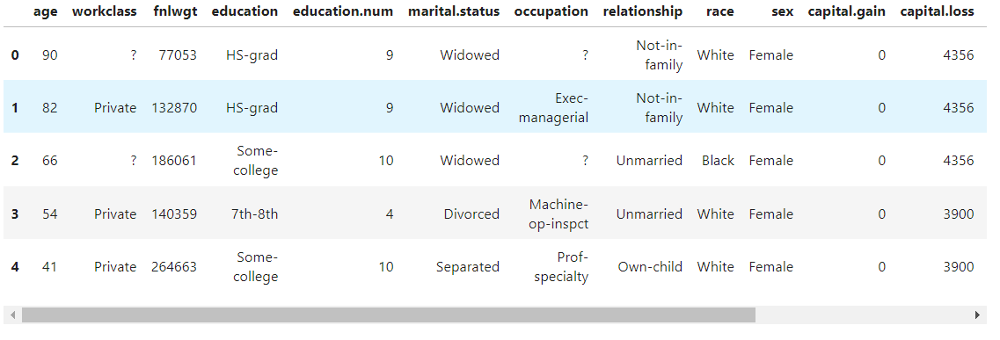

## Hi there, I'm Rafael Gardel - Data Scientist, Master's Degree in Industrial Engineering (USP).

I have 7 years of programming experience and 4 years of experience with Python, mathematical modeling, SQL, and data analysis.

I currently work as a mid-level Data Scientist providing services to Ambev, where I focus on mathematical modeling of problems related to beer production processes using operations research, leveraging Python, Gurobi, Highspy, and Pyomo.

I have previously worked as a Data Scientist focused on logistics and as a Senior CRM and BI Analyst in a multinational retail company with a focus on credit cards.

I hold a master’s degree in Production Engineering from Poli-USP, with a focus on Operations Research, particularly in mathematical modeling and optimization using tools like Gurobi and Pyomo, especially applied to logistics and financial problems.

## Detailed Work Experience
**Data Scientist @ BRQ (Ambev) (_May 2024_ - _October 2024_)**: Within BRQ I worked for the company Ambev carrying out the main activities: 
- Mathematical modeling of problems related to beer production processes using operational research using Gurobi and Pyomo;
- Creation of exact models (MILP) for filtration and refrigeration processes.

**Data Analyst @ Milenio Capital (_January 2024_ - _April 2024_)**: Development and improvement of dashboards in Power BI and automation of activities using Python.

**Freelance Data Scientist @ Self-employed (_July 2023_ - _January 2024_)**: Currently, I am working on Python projects as a freelancer for two companies. In both projects, I am using NLP and machine learning to optimize marketing strategies and increase sales. 
- Natural Language Processing (NLP) using transformers. 
- Creation of classification and regression models.

**Data Scientist @ Thera Consulting (_March 2023_ - _July 2023_)**: 
- I worked as a data scientist, modeling and creating specific methods for an optimization project involving Brazil, China, and Austria.
- Mathematical modeling of logistics problems using Gurobi.
- Refactoring Python code.
- Version control of code with Git and testing using Azure and GCP platforms.

**Senior BI CRM Analyst @ Cencosud (_April 2022_ - _February 2023_)**: I worked in the CRM and BI area for credit cards in several brands, performing the following main activities:

- Generating insights from data analysis in QlikView, Power BI, and Microstrategy databases to increase conversion rates for campaigns and products.
- Automating ETL processes, creating databases, and generating reports using QlikView (scripting and macros) and Python.
- Migrating existing databases and reports from QlikView to Microstrategy in the cloud for faster report creation and insight generation.
- Creating machine learning models (classification, clustering, regression, NLP, and data mining) for churn prediction, generating insights, and improving segmentation. I structured and executed the entire ML process flow for the department.

**Teaching Assistant, University of São Paulo (USP) (_April 2021_ - _July 2021_)**:

- Provided support to students with questions about modeling and optimization in production systems courses.
Engineering Internships, (_August 2015_ - _May 2019_)

- Worked at three companies in the Oil & Gas and Optical Fiber sectors, performing activities such as process mapping, material tracking in SAP, generating indicators, and automating Excel spreadsheets using VBA programming.

## Education
- Master’s Degree in Production Engineering | University of São Paulo (USP): My research focuses on offshore rig routing for oil and gas production. (_2020 - 2024_)

- Link to my Master's Dissertation: [Scheduling of Heterogeneous Drillships in Offshore Activities Considering Eligibility.](https://www.teses.usp.br/teses/disponiveis/3/3136/tde-26082024-102601/pt-br.php)

- Bachelor's Degree, Production Engineering | Federal Fluminense University (November 2019)

- I have 12 publications, including 1 master’s thesis in Production Engineering, 5 book chapters, 4 conference presentations, 2 articles, and I have taught 2 Python minicourses for Engineering. I also have various publications on Medium about project management, VBA, and scientific research.

- During my undergraduate studies in Production Engineering at UFF, I participated in a junior enterprise, serving as marketing director and was one of the founders of the Production Engineering Academic Center (CAEPRO) in the marketing area.

## Languages and Tools
- Python (Numpy, Numba, Pandas, Scikit-learn, TensorFlow, Seaborn, Plotly, Matplotlib)
- Automated testing (Pytest, Github actions)
- Refactoring (Pylint)
- R (Statistical Analysis)
- SQL (Mysql, SQL Server, PostgreSQL, DBeaver)
- Power Bi (DAX)
- Azure
- GCP
- Microstrategy
- Qlikview
- Airflow
- Docker
- GIT
- Julia
- C++
- VBA

## My Programming Experience
- Python, Machine Learning, SQL, Operations Research, Optimization, Logistics, Power BI, Docker, Azure, GCP.

- Julia and C++: Focus on creating heuristics for optimization problems.

- Classification models, regression, NLP, LLM, clustering, and mathematical models for operations research, especially involving VRP in Gurobi, Pyomo, and Highs.

## Volunteer Work
**Director of Communication, Academic Engineering Center, (2014 - 2016)** 
- Coordinated communication between the academic center and students.

**Director of Marketing, Junior Company Focus Consultoria, (2014 - 2016)**
- Managed company relationships with clients and stakeholders.
- Structured client and partner prospecting.
- Implemented customer retention strategies.

### Languages:
- Advanced English.
- Basic Spanish.
- Native Portuguese.

## 💻 Latest Projects
Currently, I have 13 projects in my portfolio. You can check each of them below:

<!-- BLOG-POST-LIST:START -->

## Implementing a hybrid of genetic algorithm and simulated annealing for the vehicle routing problem in Julia

This project aimed to create a simple application of the genetic algorithm meta-heuristic applied to the vehicle routing problem (VRP), using the Julia language. The Julia language was chosen because it is a high-performance language with speed compared to the C language.

- [Click here to see the project on GitHub](https://github.com/rafaelgard/Implementing-a-genetic-algorithm-for-the-vehicle-routing-problem-in-Julia)

## Optimization Projects with Gurobi, Highs and Pyomo

This repository contains implementations of 4 optimization problems, all developed using the Gurobipy, Pyomo, Highspy libraries, and the GLPK solver. The solutions provide optimized approaches to challenges related to vessel routing, fuel allocation on ships, and drone routing for surveillance of areas of interest.

- [Click here to see here the project on github](https://github.com/rafaelgard/Projetos_de_Otimizacao_com_Gurobi_Highs_e_Pyomo)

## Simulated Annealing

This project aimed to create a simple and visual application of the Simulated Annealing metaheuristic in the context of image processing.

Starting from a matrix that represents an image, the algorithm gradually converges to the target image, and it is possible to observe the entire conversion process executed by the algorithm.

The algorithm used is based on the original article proposed by Kirkpatrick et al. (1983).
- [Click here to see here the project on github](https://github.com/rafaelgard/Simulated-annealing)

## Text Based Nps Predictor

This project aimed to create a classifier using NLP techniques to predict a customer's NPS (Net Promoter Score) based on comments entered by the user.

From a comment, it is possible to indicate the prediction of the customer's NPS classification, which can be: Detractor, neutral or promoter.

Using the model, it is possible to speed up the evaluation of comments and the NPS classification in order to enable a faster response to a company's customers.

A customer completed a satisfaction survey and is very dissatisfied? It is possible to detect this in real time with the trained model and initiate a cancellation prevention action, for example triggering a communication or alert in the customer relationship center.

- [Click here to see here the project on github](https://github.com/rafaelgard/text_based_nps_predictor)

## Starbucks Reviews EDA, NLP and ML

This project aimed to carry out exploratory data analysis, NLP and the creation of a machine learning model to predict review scores based on comments.

From a comment it is possible to indicate the prediction of the rating given by the customer. This score varies between 1 and 5.
- [Click here to see here the project on github](https://github.com/rafaelgard/Starbucks_Reviews_EDA_NLP_ML)

## Data Science Applied to Military Enlistment

The objective of the project is to analyze demographic data regarding people who enlist and predict the conditions that imply selection to serve in the Brazilian army.

I also made a publication on Medium describing in detail each step taken in this analysis.

- [Click here to see here the project on github](https://github.com/rafaelgard/Data-Science-Aplicado-ao-Alistamento-Militar)
- [Click here to see here the project on medium](https://rafael-gardel.medium.com/data-science-aplicado-ao-alistamento-militar-411b727bbbb3)

## Analyzing the National Vaccination Campaign against Covid-19 with Data Science

Which group has been vaccinated the most so far? How old is the oldest Brazilian who has already been vaccinated? Who leads the ranking of vaccinated people, men or women? Which manufacturer is the most commonly used vaccine? What is the average age of those vaccinated? What is the predominant color among those already vaccinated? These and other questions will be answered in this project.

- [Click here to see here the project on github](https://github.com/rafaelgard/Analisando-a-Campanha-Nacional-de-Vacina-o-contra-Covid-19-com-Data-Science)

- [Click here to see here the project on medium](https://rafael-gardel.medium.com/analisando-a-campanha-nacional-de-vacina%C3%A7%C3%A3o-contra-covid-19-com-data-science-621d6dc06f7c)

## Data Science applied to the SUS waiting list in the city of Rio de Janeiro

How many days on average does a carioca stay on the SUS waiting list to undergo a procedure? What are the most requested procedures? Which hospitals have the longest queues? How old is the oldest patient in line? And the youngest? These and other questions will be answered in this project.

- [Click here to see here the project on github](https://github.com/rafaelgard/Data-Science-aplicado-a-lista-de-espera-do-SUS-na-cidade-do-Rio-de-janeiro)
- [Click here to see here the project on medium](https://rafael-gardel.medium.com/data-science-aplicado-a-lista-de-espera-do-sus-na-cidade-do-rio-de-janeiro-2203ade764ac)

## Adult income dataset analysis
A study on individual annual income resulting from several factors. such as the individual's education, age, sex, occupation, etc.

- [Click here to see here the project on github](https://github.com/rafaelgard/Adult-income-dataset-analysis)

<!-- BLOG-POST-LIST:END -->

---

### 💡 Some Other Cool Projects I Have Made
<!-- BLOG-POST-LIST:START -->
- [Minicourse-Python-To-Engineering](https://github.com/rafaelgard/Minicurso-Python-Para-Engenharia)
- [Gurobi_helper](https://github.com/rafaelgard/Gurobi_helper)
- [Pandas_to_NLP](https://github.com/rafaelgard/Pandas_to_NLP)
- [Append_CSV](https://github.com/rafaelgard/Junta_CSV)
<!-- BLOG-POST-LIST:END -->

---
You can reach me out on any channels below!

- [Heres my Linkedin](https://www.linkedin.com/in/rafael-gardel-b1976999/)
- I also have a blog at [Medium](https://https://rafael-gardel.medium.com/)
- You can also send me an [email](mailto:rafaelgardel@usp.br)

[back](https://rafaelgard.github.io/)